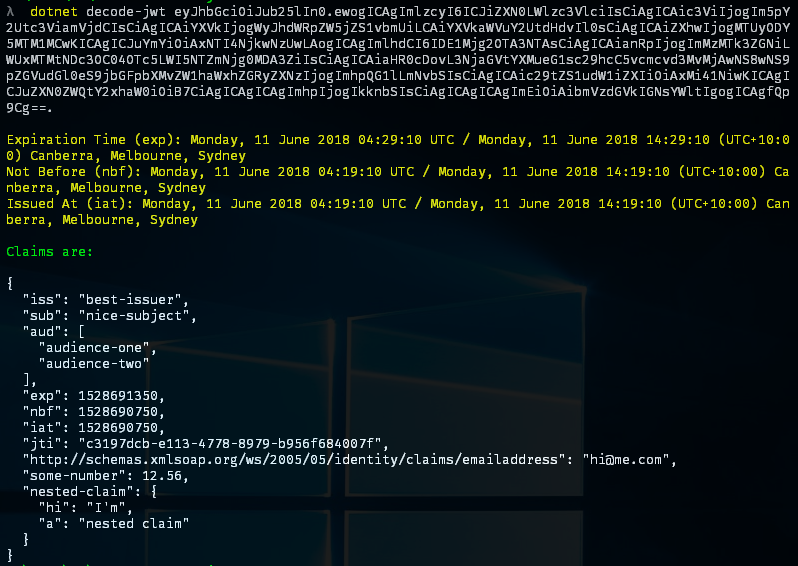

# Decode JWT

`.NET` [global tool][dotnet-global-tools] to decode `JSON Web Token` claims.

| Package             | Release                                                |
| ------------------- | ------------------------------------------------------ |
| `dotnet-decode-jwt` | [![NuGet][nuget-package-badge]][nuget-package-command] |

| CI                       | Status                                                   | Platform(s) | Framework(s) |
| ------------------------ | -------------------------------------------------------- | ----------- | ------------ |
| [GitHub][github-actions] | [![Build Status][github-actions-shield]][github-actions] | `Ubuntu`    | `net6.0`     |



## Installation

```posh
> dotnet tool install -g dotnet-decode-jwt
```

## Usage

```powershell
> dotnet decode-jwt eyJhbGciOiJub25lIn0.ewogICAgImlzcyI6ICJiZXN0LWlzc3VlciIsCiAgICAic3ViIjogIm5pY2Utc3ViamVjdCIsCiAgICAiYXVkIjogWyJhdWRpZW5jZS1vbmUiLCAiYXVkaWVuY2UtdHdvIl0sCiAgICAiZXhwIjogMTUyODY5MTM1MCwKICAgICJuYmYiOiAxNTI4NjkwNzUwLAogICAgImlhdCI6IDE1Mjg2OTA3NTAsCiAgICAianRpIjogImMzMTk3ZGNiLWUxMTMtNDc3OC04OTc5LWI5NTZmNjg0MDA3ZiIsCiAgICAiaHR0cDovL3NjaGVtYXMueG1sc29hcC5vcmcvd3MvMjAwNS8wNS9pZGVudGl0eS9jbGFpbXMvZW1haWxhZGRyZXNzIjogImhpQG1lLmNvbSIsCiAgICAic29tZS1udW1iZXIiOiAxMi41NiwKICAgICJuZXN0ZWQtY2xhaW0iOiB7CiAgICAgICAgImhpIjogIkknbSIsCiAgICAgICAgImEiOiAibmVzdGVkIGNsYWltIgogICAgfQp9Cg==.

Expiration Time (exp): Monday, 11 June 2018 04:29:10 UTC / Monday, 11 June 2018 14:29:10 (UTC+10:00) Canberra, Melbourne, Sydney
Not Before (nbf): Monday, 11 June 2018 04:19:10 UTC / Monday, 11 June 2018 14:19:10 (UTC+10:00) Canberra, Melbourne, Sydney
Issued At (iat): Monday, 11 June 2018 04:19:10 UTC / Monday, 11 June 2018 14:19:10 (UTC+10:00) Canberra, Melbourne, Sydney

Claims are:

{
  "iss": "best-issuer",
  "sub": "nice-subject",
  "aud": [
    "audience-one",
    "audience-two"
  ],
  "exp": 1528691350,
  "nbf": 1528690750,
  "iat": 1528690750,
  "jti": "c3197dcb-e113-4778-8979-b956f684007f",
  "http://schemas.xmlsoap.org/ws/2005/05/identity/claims/emailaddress": "hi@me.com",
  "some-number": 12.56,
  "nested-claim": {
    "hi": "I'm",
    "a": "nested claim"
  }
}
```

[nuget-package-badge]: https://img.shields.io/nuget/v/dotnet-decode-jwt.svg?label=NuGet&style=flat-square
[nuget-package-command]: https://www.nuget.org/packages/dotnet-decode-jwt
[dotnet-global-tools]: https://docs.microsoft.com/en-us/dotnet/core/tools/global-tools
[github-actions]: https://github.com/gabrielweyer/dotnet-decode-jwt/actions/workflows/build.yml
[github-actions-shield]: https://github.com/gabrielweyer/dotnet-decode-jwt/actions/workflows/build.yml/badge.svg
